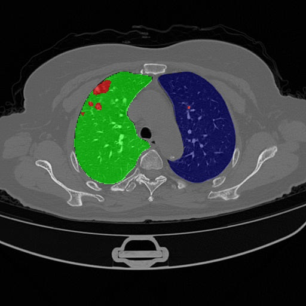
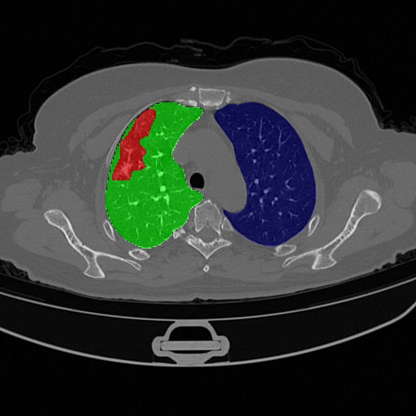
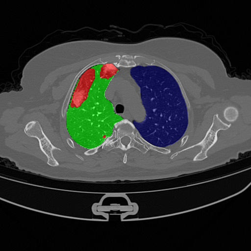
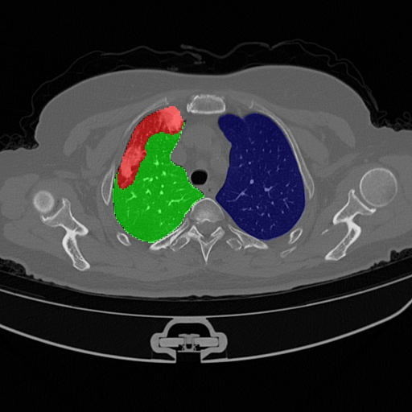

<h1>Spark in the Dark: Evaluating Encoder-Decoder Pairs for COVID-19 CT's Semantic Segmentation</h1>

<div style="display:flex;">
    
    
    
    
</div>

<h2>See the implementation and the available networks in: <a href="https://github.com/qubvel/segmentation_models.pytorch" target="_blank">Segmentation Models</a></h2>

<h2>Installation:</h2>

<p>pip install -r requirements.txt</p>

<p>Copy the files inside the scripts to the utils folders inside the lib/python3.6/site-packages/segmentation_models_pytorch folder</p>

<h2>Dataset:</h2>

<p>Setup a txt file with the images paths as follows for training and validation:</p>

<p>path/to/image1.jpg path/to/mask1.png <br>
path/to/image2.jpg path/to/mask2.png <br>
path/to/image3.jpg path/to/mask3.png</p>

<p>or just the images paths for tests</p>
<p>path/to/image1.jpg<br>
path/to/image2.jpg<br>
path/to/image3.jpg</p>

<p>Setup the config file following the examples in the config folder</p>

<h2>Execute:</h2>
<p>python main.py --configs config_file.yml</p>

<h2>Citation</h2>

```
@inproceedings{9605461,
  author={Krinski, Bruno A. and Ruiz, Daniel V. and Todt, Eduardo},
  booktitle={2021 Latin American Robotics Symposium (LARS), 2021 Brazilian Symposium on Robotics (SBR), and 2021 Workshop on Robotics in Education (WRE)}, 
  title={Spark in the Dark: Evaluating Encoder-Decoder Pairs for COVID-19 CT’s Semantic Segmentation}, 
  year={2021},
  volume={},
  number={},
  pages={198-203},
  doi={10.1109/LARS/SBR/WRE54079.2021.9605461}
}
```

```
@inproceedings{sbcas,
 author = {Bruno Krinski and Daniel Ruiz and Eduardo Todt},
 title = {Light In The Black: An Evaluation of Data Augmentation Techniques for COVID-19 CT’s Semantic Segmentation},
 booktitle = {Anais do XXII Simpósio Brasileiro de Computação Aplicada à Saúde},
 location = {Teresina},
 year = {2022},
 keywords = {},
 issn = {2763-8952},
 pages = {156--167},
 publisher = {SBC},
 address = {Porto Alegre, RS, Brasil},
 doi = {10.5753/sbcas.2022.222495},
 url = {https://sol.sbc.org.br/index.php/sbcas/article/view/21628}
}
```
